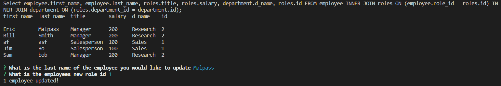

Unit 12 MySQL Homework: Employee Tracker

In this homework I created an employee tracking system.

As a business owner
I want to be able to view and manage the departments, roles, and employees in my company
So that I can organize and plan my business

GitHub Repo: 
https://github.com/EricMalpass/employee-tracker/

Video:
https://drive.google.com/file/d/1tkY1ijQ-Bb_w4e8f1EecUP-TTF0xyRpz/view

I recieve alot of support from my study group, tutur, askbcs tuturs, and various websites:

Study Group:

-Sam Oberg

Tutur

-Quint Turner
